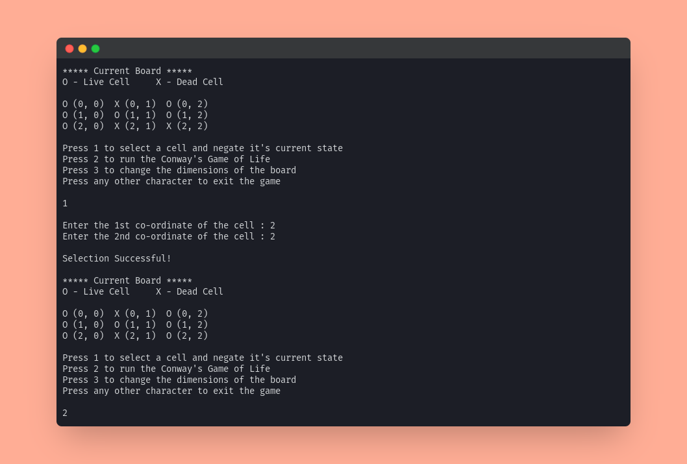
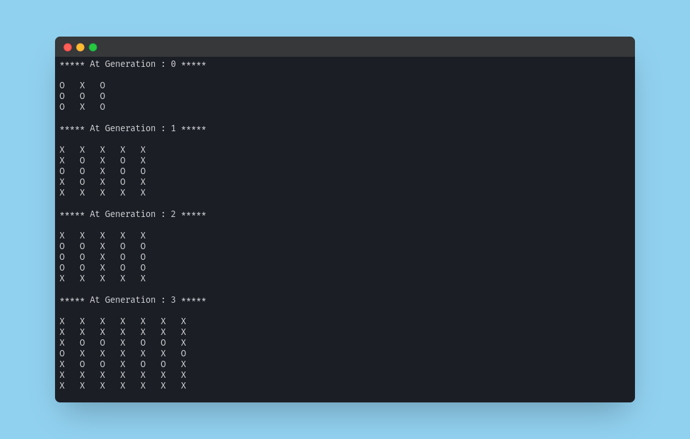
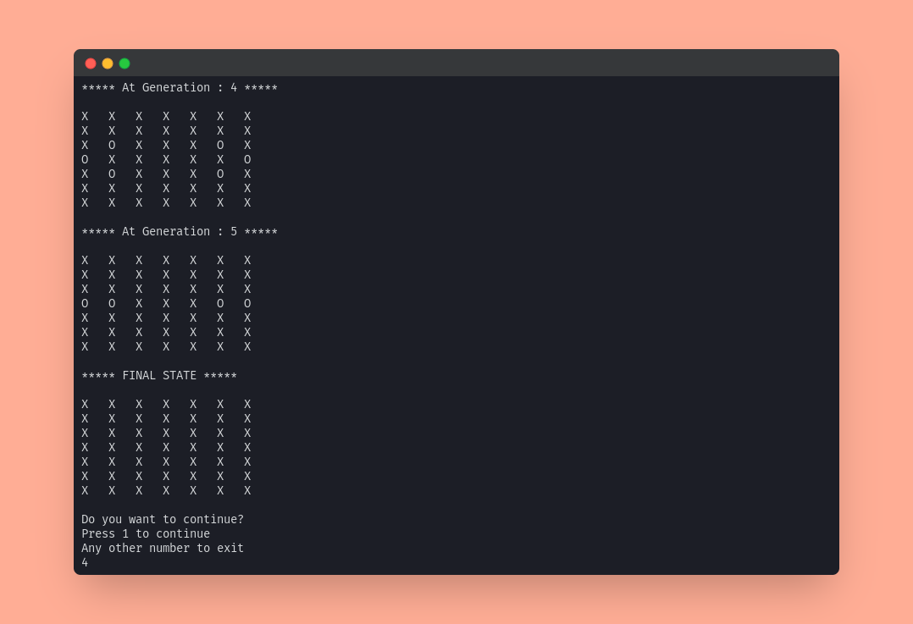

# Conway's Game of Life

A Graphical Interface Application which accepts the starting conditions and helps the user to observe the Game of Life through many generations.

## Rules of the game

-   Any live cell with two or three live neighbours survives.
-   Any dead cell with exactly three live neighbours becomes a live cell.
-   All other live cells die in the next generation. Similarly, all other dead cells stay dead.

## Features

-   Users can change the dimensions of the board at any time.
-   Users can change a live cell to dead or vice versa by giving input of the coordinates of the cell.
-   Each generation will be printed.
-   The board will automatically expand as and when it's needed to accommodate the live cells out of bounds.
-   The game will stop when the board has all dead cells or if it's encountering the same pattern.

## Screenshots

_To view the full Terminal interaction, please click [here](http://p.ip.fi/142e)._





## Project Structure

```bash
├── Game.java
├── src
│   ├── Board.java
│   └── Display.java
├── TestGame.java
└── tests
    ├── TestBoard.java
    ├── TestLogic.java
    └── TestSuite.java
```

-   **Game.java** - This is the main Game class which is instantiated when the game starts. The Board and Display classes are instantiated here.
-   **src**
    -   **Board.java** - This is the Board class which controls the board's values and has various methods to make use of the board from the Game class.
    -   **Display.java** - This is the Display class which has various methods to coordinate the output and input of the user.
-   **TestGame.java** - This is the main Test class which is instantiated when we start the tests. This inturn imports JUnit and runs the TestSuite class.
-   **tests**
    -   **TestBoard.java** - This class has various tests to test all the methods of the Board Class.
    -   **TestLogic.java** - This class has multiple tests to test the logic of our game and keeps a check on the input and output.
    -   **TestSuite.java** - This class encapsulates the TestBoard and TestLogic classes and runs alls the tests once this class in instantiated in the TestGame class.

## Steps Followed to do this Project

-   Started with the Display class to get the inputs from user.
-   Then worked on the Board class to initialize the board and created various needed methods.
-   Then created the main Game class to overlook the working of the game and to call the necessary methods from Board and Display class when needed.
-   Then wrote the unit tests in JUnit to test the various class methods and the logic of the game using various test cases.

## Scope for Improvement

-   **Using Hash Maps to store the previous states and stop the game when a previous state repeats** - In the game now if 2 patters alternate each other we end up in a an infinite loop. However we can fix this using a Hash Map and encode out Live cells coordinates like "1,2,3,2,3,4," where the points of live cells are (1,2),(3,2),(3,4). So when we encounter this same pattern we can check it in the hash maps if its present. And if it's present we can end the game cause it will anyway repeat the same pattern which already occurred. If it's not present we can just mark this pattern as encountered and continue the game.

## Dependencies

-   JAVA (OpenJDK 11.0 +)
-   JUnit (V4.0 +)

## Run Locally

Clone the project

```bash
  git clone https://link-to-project
```

Go to the project directory

```bash
  cd my-project
```

Compile the code

```bash
  javac Game.java
```

Run the code

```bash
  java Game
```

## Running Tests

To run tests, run the following commands

```bash
  javac TestGame.java
```

```bash
  java TestGame
```

## Resources Used
